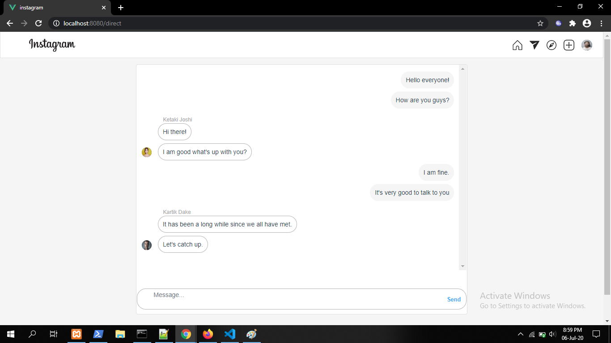

# instagramclone

## Project setup
```
npm install
```

### Compiles and hot-reloads for development
```
npm run serve
```

### Compiles and minifies for production
```
npm run build
```

### Customize configuration
See [Configuration Reference](https://cli.vuejs.org/config/).

### Note
This project is for educational purpose only.

### Screenshots

Screenshot 1


Screenshot 2


Screenshot 3


Screenshot 4


### Other Tech Stacks
Mobile App: Flutter
https://github.com/SiddharthVermaS/InstagramClone-Flutter

Backend: Node.js
https://github.com/SiddharthVermaS/InstagramClone-NodeJs-MySQL